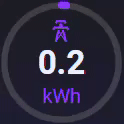

# RdG circle card

Visual, responsive and dynamic circular cards for Home Assistant Lovelace dashboards.  
This repository contains tthe following custom card:
- **rdg-circle-card**: a single, animated radial circle with value display

For an extra view with a maximum of 6 circles, download the rdg-multicircle-card (rdg-circle-card needed!):
- **rdg-multicircle-card**: a 2x3 grid of six configurable circles

---

## 🛠 Installation (via HACS)

1. Go to HACS → Settings → Custom Repositories
2. Add: `https://github.com/rjdgroot/rdg-circle-card`
3. Select **Lovelace** as category
4. After adding, find **RDG Circle Cards** in the Frontend section
5. Install and then add to your dashboard resources:

```yaml
- url: /hacsfiles/rdg-circle-card/rdg-circle-card/rdg-circle-card.js
  type: module
- url: /hacsfiles/rdg-circle-card/rdg-multicircle-card.js
  type: module
```

---

## 🔘 rdg-circle-card



A customizable animated radial card for single values.

### 🔧 Example configuration

```yaml
type: custom:rdg-circle-card
entity: sensor.energy_usage
name: Power
unit: W
min: 0
max: 3000
strokeWidth: 12
trackWidth: 4
color: '#FF9900'
backgroundColor: '#202020'
tap_action:
  action: more-info
```

### ⚙️ Options

| Option         | Description                              | Default     |
|----------------|------------------------------------------|-------------|
| `entity`       | The entity to track                      | **required**|
| `name`         | Label shown under the circle             | Entity name |
| `unit`         | Unit shown in center                     | From entity |
| `min` / `max`  | Value range                              | 0 / 100     |
| `strokeWidth`  | Thickness of the circle arc (px)         | 10          |
| `trackWidth`   | Thickness of the track background (px)   | 4           |
| `color`        | Color of the arc                         | var(--primary-color) |
| `backgroundColor` | Color of the track                   | var(--card-background-color) |
| `tap_action`   | Action when tapped                       | none        |

---


## 🧪 Roadmap / Ideas

- [ ] Color gradients based on value
- [ ] Many more to come

---

## 📄 License

Created by [@rjdgroot](https://github.com/rjdgroot)
